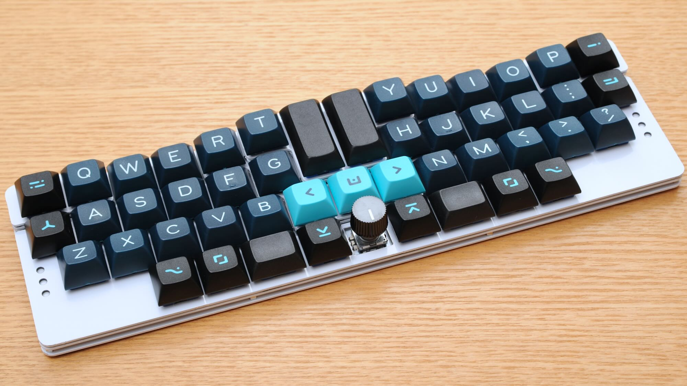
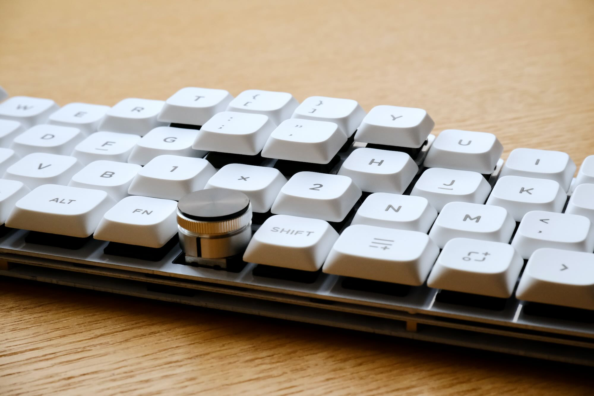

この記事はキーボード Advent Calendar 2024の記事かもしれません。〓TODO

昨日の記事や明日の記事へのリンク？〓

---

1年半ぶりに*End Game*を更新した[SandyLP](https://github.com/jpskenn/SandyLP)の紹介と、ちまちま書いていたメモを読み返したら自分に刺さりまくった話です。

TODOメモを読み返して、技術的というよりも、精神的なことを再確認した感じ？

## SandyLP（サンディ エルピー）

今年、2024年10月、左右対称ロスタッガードな所謂Jones配列（※）の最新版として[SandyLP（サンディー エルピー）](https://github.com/jpskenn/SandyLP)が完成しました。  
<small>※自分で”Jones配列”と言い始めたわけではないのですが、キボ界隈からそう呼ばれていて記述もしやすい呼称なので使わせてもらっています。</small>





Jones配列のキーボードは、
2020年8月 左右対称ロスタッガード60%の”[Jones（ジョーンズ）](https://github.com/jpskenn/Jones)”、  
2022年1月 Jonesをロープロファイル狭ピッチにした姉妹機”[Nora（ノラ）](https://github.com/jpskenn/Nora)”、  
2023年4月 Jonesのスイッチを立体的に配置した進化版”[Sandy（サンディー）](https://github.com/jpskenn/Sandy)”、  
と開発を続け、  
そして今回、Sandyをロープロ40%にした改良版”[SandyLP（サンディー エルピー）](https://github.com/jpskenn/SandyLP)”として、約1年半ぶりの新作となります。  

ざっくりとした変更点は…

- スイッチをMXからChoc V2に変えて、キーボード全体を低く。
- レイアウトを60%から40%へサイズダウン。  
- 直付けMCUをATmega32u4からRP2040に変更。  

といったところですが、細かいところも含め、前作Sandyから得られた経験を可能な限りフィードバックしたので、SandyLPが完成した瞬間から新たな*End Game*が始まりました。  

キーキャップとChoc V2スイッチの干渉を心配していたのですが、お気に入りのDSS・Cherry・KATは以下の組み合わせで使えているので助かっています。（KATは少しスイッチに当たっているようだけど、気にならないレベル。）  

- Kailh Deep Sea Silent MINI + Signature Plastics, DSS, Solarized Dark
- Kailh Deep Sea Silent MINI + ePBT, Cherry, Less But Better
- Kailh Lofree FLOW GHOST + Keyreative, KAT, Space Cadet

今後はケースの設計に手を出したりしつつ、*End Game*という長期ロードテストを楽しんでいこうと思っています。

今回、GH60型ケース*非対応*としたことで様々な制約から解放され、ある意味で自由な開発をおこなうことができたのが楽しかったです。

## ちまちまメモRemix

テキストファイルにちまちまと書き溜めていたメモを読み返したら、思いのほか自分に刺さりまくりました。  
界隈の誰かにも刺さりそうな気がするので、いくつか載せてみます。

### Sandyを家に忘れ、F社のノートPCを1日使ったあとの悟り

職場で使っている自キを持ち帰って完璧に整備したのに家に忘れてしまい、F社のノートPCのキーボードを1日使うことになった残念な日のメモ。

「スイッチの打鍵感や筐体などの要素は、二の次、三の次といったところであり、やはり配列が一番の肝である」

ノートPCのペチペチとした打鍵感は許容できるけれど、レガシーロースタガなキー配列は左手がつらすぎてどうしようもなく、つらい1日となりました。  
以前からそうですが、僕は打鍵感の追求よりも、自分が使いやすいレイアウトに早くたどり着きたいと思っています。

### ホームポジションは左右対称じゃない、にんげんだもの

「R4の`/`キーが右手小指に当たるのが気になった。反対側の`z`は左手小指に当たらないので、手の形の違いか、ポジションが左右でちょっと違うのかというところ。」
読み返していて思ったのは、左手には時計をつけてるから、その差かも？家で時計をしてないときはどうなんだろう？
いずれにしても、ちょっとした違いだろうけどね。
レガシーロースタガみたいに、手がハの字に広がらない（って）のは、異常としか言えない…

### 自然な手のポジションとは？

「なんとなくのイメージとして、ボール（野球のボールより、もうちょい大きなソフトボールくらいを想定）に軽く手を乗せたような感じが、指が自然な感じでキーの上にあると思う。」
そういうこともあって、僕がJonesやSandyを使うとき、指の定位置は`A`, `W`, `E`, `F`, `スペース`になっています。薬指と中指の「`W`と`E`」を「`S`と`D`」にすると、指がまがってつらいのです。

### 指を伸ばすのは無理だが、手首は曲げることができる。

「Twitterで少し古めのキーボード写真のツイートを見て、R2右端の`BS`を、`BS`ともうひとつ、たとえば`DEL`などの2キーにするのが面白そうに思えた。
～中略～
当然、このキーを打鍵するにはホームポジションを崩すことになるが、`Y`の左のキーを人差し指を伸ばして打鍵するよりも、`BS`の右のキーを（ちょっと窮屈だけれど）手首を曲げて小指で打鍵する方が、打鍵しやすそう。」
やってみればすぐにわかるが、`Y`の左のキーは、手首を斜め前へ出してこない限り打鍵することはは不可能。「手首を動かす＝腕全体を動かす」であり、動作が非常に大きい。
多少窮屈だったとしても、手首をちょっとひねる動作の方が、はるかに小さい動きで済ませることができる。
`H`の左だったら、同様に手首をひねるだけでいけるが、`Y`の左はどうしても無理。

### キースイッチは真上から押すだけだと思っていないか？

「スペースキーとそれよりひとつ外側のキーのスイッチを`Tecsee Pudding Medium Linear`に変更して少し低くし、一番外側のキーの角に親指がかかる感じにした。これで、キーの横から斜め下へ押下する具合にしたい。」
いまさらこんなことを言うのも恥ずかしい感じがするが、キースイッチは真上からだけでなく、多少斜めに押しても動作する。キーキャップの天面がシリンドリカルやスフェリカルになっているのは、指のかかりを良くする以外にも、多少斜めに押したときでもスイッチへ力を伝える役割も持っているはず。
これをもう少し拡大して解釈して、隣のキーと段差をつけておいて、指をキーキャップの腹か天面の角あたりへヒットさせることで、スイッチを押下する。
〓動画必要〓
この動画では、横に向けた親指を曲げる動作しかしていないが、スイッチが反応している。
隣のキーと段差があるからこそできる技である。

### 2u-Wideの発見

「Jonesのv.0.2（2020年8月）でアルファ部の右手側を2u外側へずらした2u-Wideを発見したのは、今さらながらなかなか良い発見だった。
それから4年がたった今でも、Jonesの後継となるSandyで2u-Wideを使っている。」
右手小指付近にある記号キーをキーボードの中央へ移動して、左右の手を2キー分広げるという2u-Wide。Jonesでいろいろやっているうちにたまたま発見したレイアウトだが、気付けば4年も使っていた。
当初は、「2u-Wideを使った後に普通のキーボードを使うと誤爆が多発する」という理由から一旦は使用を自粛していたが、どうしても肩が閉じてしまう一体型キーボードのレイアウトにおいて、少しでも肩が楽になるようにしたいという思いで使用を継続。
`Y`,`H`,`B`の右手？左手？問題も1週間ほどの矯正で治ってしまったので、4年間、ずっと肩が楽だったということになる。
そんな2u-Wideだが、使い始めた当初、つまりJonesのv.0.2を組み立てた2020年8月のメモには次のような思いを書いていた。
「ハード面、ソフト面だけでなく、自分自身の改良・変更をおこなうのも自キ道の範疇に含まれると考え、今回は左手Yの癖を矯正することにした。」
いやー、このときの僕、良い判断してるやんか。

### 数日寝かせると命拾いする

「ひとまず、すべての基板とスイッチプレートの配線等が完了。
数日寝かせて、細部のチェック等をおこなう予定。」
寝かせた結果
〓ツイート〓


### [Sandy（サンディー）](https://github.com/jpskenn/sandy)の開発（はじまり編）, 2022年12月末～2023年3月

昨年、2022年は、

「自分で設計したキーボード、[Jones（ジョーンズ）](https://github.com/jpskenn/jones)とその姉妹機である[Nora（ノラ）](https://github.com/jpskenn/nora/)の物理配列にハマりすぎて、欲しいキーボードがない」

という状態が続いていました。

とは言え、

- 人差し指での`Y`が、ちょっと遠い
- 小指で`P`を打鍵すると、指の腹が手前のキーに当たる
- `1行目`を打鍵するには、ホームポジションを崩すしかない

といった不満もあり、どうにかしたい気持ちはくすぶり続けていました。

2022年12月の末、Jonesのキーキャップを部分的に取り替えるところから始まったのが[Sandy（サンディー）](https://github.com/jpskenn/sandy)の開発です。
  
Jonesのキーキャップを部分的に取り替えたテスト機

各部を調整したり基板の立体配置に苦労したりしながら、ようやく試作1号基板を発注しようかという頃、Glove80が届きました。

### [Glove80](https://www.moergo.com), 2023年3月下旬

#### Glove80の入手まで

以前から「各個人の手の大きさや指の長さに合わせて、3D形状的にキーが配置されたものが究極のキーボードなんじゃないかな？」という気持ちがあり、機会があれば使ってみたいと思っていました。
とは言え、3Dの代表格であるKinesis Advantage2は筐体がでかすぎて置き場所に困るし、自分で3Dプリントするのはハードルが高いし、なかなかその機会が巡ってきませんでした。

2021年の末くらい（？）にKinesisから左右分離型で３D形状のAdvangate360が発表され、少しくらい高くても買う気になっていたのですが、発売以降ずっと手に入らないような状態が続き、入手を断念しました。

そういう状況だった2022年2月、左右分離型で3D形状のGlove80がKickstarterに登場しました。
プラ筐体でホットスワップなしのChocスイッチという構成でしたが、「待てば手に入る」という魅力に負け、入手まで1年以上かかることを承知の上でバックし、なるべく忘れるようにして毎日を過ごしていました。
バックしてから1年ほどが経過した2023年の1月～2月頃、「パイロット版を先行して出荷している」というレポートを読みつつのんびりと待っていると、3月下旬にいきなり届きました。

始めての3D
<blockquote class="twitter-tweet"><p lang="ja" dir="ltr">まだ手のポジションが定まりませんが <a href="https://twitter.com/hashtag/Glove80?src=hash&amp;ref_src=twsrc%5Etfw">#Glove80</a> でWPM 70くらいは出るようになってきました。<br>親指のModやBS、Enterなどにまだ慣れなくて、こんなツイートをするだけでも、かなりの苦労＆苦痛です☹️<br><br>その他、いろいろ思うことも多いので、ちょいちょいメモしながら使ってます。 <a href="https://t.co/t5H4dmFasO">pic.twitter.com/t5H4dmFasO</a></p>&mdash; Takeshi Nishio (@jpskenn) <a href="https://twitter.com/jpskenn/status/1639393715881123840?ref_src=twsrc%5Etfw">March 24, 2023</a></blockquote> <script async src="https://platform.twitter.com/widgets.js" charset="utf-8"></script>

アルファ部はあまり意識しなくても打鍵でき、monkeytypeでWPM 70くらは出せました。普段使いのJonesでWPM 75-80くらいなので、アルファ部だけなら十分に使えそうな感じです。
問題はそれ以外のキーで、ModキーやBS、Enterを親指に配置したのですが、これらの打鍵に慣れなくて苦労しました。まぁ、これはGlove80に限った問題ではありませんが…

#### Glove80の良いところ

- 打鍵に関しては意外とすぐに慣れる
- Bluetoothは何も心配いらない
    Macとの接続は、普通につながって使えている。
    技適つき。
- キーマップ書き換えツールで、簡単に書き換えできる。
    結局、ZMKファームウェアは何も触ってない。
- オプションのパームレスト装着により、安定したポジションで構えることができる。

#### Glove80の悪いところ

- パームレストを含めたフットプリントがそこそこ大きいので、意外と場所を取る。
    60%キーボードよりも上下・左右ともに大きい。  
    中央の空間が、逆にデッドスペースになっている。  
    マウスやトラックパッドの置き場所が遠くなる。（真ん中に置くのはちょっと…）
- パームレストの高さ（数cm）だけ机から腕を上げる必要があり、浮かせた腕が疲れる。
    僕は前腕を机につけて打鍵するスタイルなので、けっこうつらい。
- パームレストで手が安定したポジションに落ち着くのは良いが、逆に、ホームポジションから手をずらしにくいため、数字行の打鍵がつらくなる。
- カラムスタガの場合と同様に、自分の手に合わない部分（僕の場合は小指）が非常に打鍵しにくい。
    ロースタガはそこまで打鍵しにくくならないのはなんでだろう？
- 各行の角度が緩やかで全体的に平ら（＝アグレッシブな3D形状ではない）なので、指を伸ばしても届かないキーがある。（キーの方から指を迎えに来てる感じが少ない）
- 小指に縦3キー担当させるのは、物理的に無理。
- どうやっても指が届かない数字行は飾り。（360とかAdvantage2とかは届くのだろうか？）

monkeytypeでWPM70ちょいくらいが出せるようになった頃、Sandyの試作1号基板が到着しました。


### [Sandy（サンディ）](https://github.com/jpskenn/Sandy)の開発（リリース編）

「Glove80がすべてを解決してくれる」という期待はあっけなく砕け散ってしまいましたが、Sandyの方が断然打鍵しやすかったので、Sandの開発にリソースを全振りすることになりました。

### RemapとQMKと

QMKバージョン0.19以降
Sandyのリリース時点では、Remapが最新のQMKリリースに対応していなかった（どういう対応をおこなうか検討中）ため、QMKバージョン0.18系でファーム

## 親指まわりのレイアウト変更（SandS, 親指Ctrl）

ShiftとCtrlを左手小指で打鍵するのをやめて、親指打鍵のSandSと親指Ctrlを導入しました。

左手小指で打鍵するとホームポジションが崩れたり、左手小指が担当する`Q` `A` `Z`キーを他の指で押したりして、指の動きが大きくなってしまっていました。  
また、左手小指をShiftで押さえるときに手のひらを外側に向けると、手首に負荷がかかっていました。

このレイアウト変更でホームポジションが崩れなくなり、打鍵が安定したことで疲れにくくなりました。

〓レイアウトのイラスト、キーマップ（RemapのPDFからトリミングでも）〓

うまく移行できるのか心配していましたが、たったの2週間で普通に打鍵できるようになりました。  
レイアウト変更から半年以上経った今では、無意識に親指が動くようになり、逆に普通のキーボードを使ったときに誤爆しがちです。

なお、親指Ctrlにしているのは職場のWindowsだけで、自宅のMacでは左Ctrlはそのままです。  
MacはCmdキーがWindowsのCtrlキー的な役割なので、そのままでも問題ないのです。

## 久々の当たりスイッチ、Kailh Deep Sea（サイレントリニア）

Sandyの試作中にサイレントリニアスイッチの自宅在庫が少なくなり、まだ使ったことのないKailh Deep Seaスイッチに手を出してみました。

これまで使っていたKailh Silent Pink（ルブ済み）と比較して、ルブなしのDeep Seaは、軸ブレの少なさ、押し下げ始めの遊びのなさ、動作のなめらかさ、ノイズの少なさなど、すべてが高レベルに実現されていて大当たりでした。  
また、サイレントスイッチにありがちな、ステムがトップハウジングへ貼りつく症状もなく、押しはじめがスムースなのが非常に好印象です。

**Kailh Deep Seaは最高のサイレントリニア**だと。

関連して…  
同じサイレントリニアのHHKB Studioについて、ちょっとメモ  
2023年11月中旬にHHKB Studioを試用する機会があり、Kailh Deep Seaを取り付けたSandyを現場に持ち込んで、隣に並べて試打してきました。  
巷で言われているように、HHKB StudioのスイッチとDeep Seaはほぼ同じフィーリングでした。

違いがありそうなのは、Deep Seaはたまにバネ鳴りのような音がする個体があるけれど、HHKBはスイッチを選別してあるのか入念にルブしてあるのかわからないけど、全スイッチが均一な感じがしました。  
（まぁ、必要数より少し多め買って自分で選別すれば、Deep Seaで問題ないと）

今年買ったスイッチに1行ずつコメント。

- Jwick V2 フルナイロンブラック リニア：スムース。ちょっと軸ブレ
- Kailh Midnight Silent V2：トップハウジングへ貼りつく症状
- Kailh Deep Sea（タクタイル）：そうでもない
- WS Silent Linear：値段が安い割に高性能。安い（2回目）
- Tecsee Pudding Medium（リニア，タクタイル）：普通のスイッチだが、高さが低い（ミディアムハイト）のが何よりの強み。意外と静か

〓他には？

## レガシーレイアウト

2023年にもなって、まだその旧来のレイアウトか…  
と思うことが何度もあったので、

```text
一般的なロースタッガード ＝ レガシーレイアウト
```

と命名しました。

## キーサイズと効率

1.5Uよりも大きいキーは、長さと面積効率が悪い
スタビ使うやつなんかは、調整のめんどさとか全部入れて効率悪い
見た目だけの方はお帰りください

## GB詐欺被害1件

## まとめ

## その他

販売とか

---
この記事は、

- Sandy（WS Silent Linear & Tecsee Medium Linear + MDA Future Suzuri）

- Jones（Kailh Pro Burgundy & Kailh Speed Silver + DSS Solarized Dark）
- Nora（Kailh Choc V1 Crystal Silver + MCC POM）
- iPhone 8（フリック入力）

で書きました。
