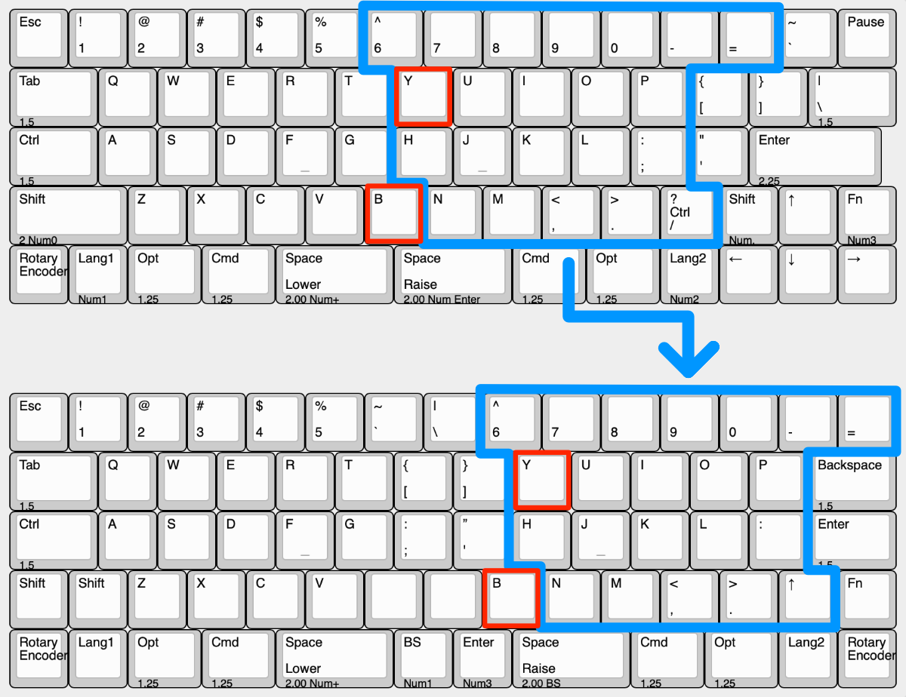

この記事はキーボード Advent Calendar 2024の記事かもしれません。〓TODO

昨日の記事や明日の記事へのリンク？〓

---

技術的なネタがないので、自キにまつわる気持ちの問題と、1年半ぶりに*End Game*を更新した[SandyLP](https://github.com/jpskenn/SandyLP)のご紹介。

## 自キにまつわる気持ちの問題

RP2040を基板直乗せするとか、ケーブルを使わずにネジとスペーサーで導通させるとか、Vialなファームウェアの作り方とか、すでにどこかで説明されているので技術的なネタがありません。

というわけで、自キにまつわる気持ちの問題（精神論？）を、いくつかピックアップしてみました。

### 自キ道？

数年前、[Jones](https://github.com/jpskenn/Jones)の開発中に、右手側のアルファ部を2キー分外へずらしたレイアウトを思いつきました。

このレイアウトには、EnterやBSが打鍵しやすいとか、肩がちょっと開いて疲れにくいといったメリットがありましたが、自作キーボードにありがちな「YとBの右手？左手？問題」にぶつかってしまいました。  
<small>今では考えられないことですが、その頃（2020年）の僕は、たまにYを左手で打鍵する癖がありました。</small>

このレイアウトを採用するか悩んだのですが、2020年8月のメモには次のような思いを書いていました。

*「ハード面、ソフト面だけでなく、自分自身の改良・変更をおこなうのも**自キ道**の範疇に含まれると考え、今回は左手Yの癖を矯正することにした。」*

***自キ道***？？？  
いや～、何を言ってるのかよくわかりませんが、結局、TとYの間に背の高いキーキャップを取り付けて、左手Yしようとする指をブロックして、1週間ほどで矯正することができました。  
それ以来ずっとこのレイアウトを使い続けているので、4年ほど肩が楽に過ごせたことになります。

別の話になりますが、親指にシフトを割り当てようとしたときも、左右端のシフトキーを取り外して、親指でしかシフトを押せない状態にして、2週間ほどで矯正できています。

「自キ道」が何なのかよくわかりませんが、キーボードは道具ですから、道具を使う人間の修練や鍛錬もある程度必要ですよね。  

### 優先事項

職場用の自キを持ち帰って完璧に整備したのに持ってくるのを忘れ、F社のノートPCのキーボードを1日使うことになった残念な日のメモ。

*「スイッチの打鍵感や筐体などの要素は、二の次、三の次といったところであり、やはり配列が一番の肝である」*

ノートPCのペチペチとした打鍵感は（気持ち良くはないけれど）我慢できる許容範囲でしたが、レガシーなロウスタッガード配列は左手がつらすぎてどうしようもなく、レイアウトの重要性を再確認させられました。  

僕は打鍵感の追求よりも、自分が使いやすいレイアウトに早くたどり着きたいと思って活動しています。

### 指を伸ばすのは無理だが、手首は曲げることができる。
### 伸ばした指をさらに伸ばすのは無理だが、左右に曲げるのは簡単

「Twitterで少し古めのキーボード写真のツイートを見て、R2右端の`BS`を、`BS`ともうひとつ、たとえば`DEL`などの2キーにするのが面白そうに思えた。
～中略～
当然、このキーを打鍵するにはホームポジションを崩すことになるが、`Y`の左のキーを人差し指を伸ばして打鍵するよりも、`BS`の右のキーを（ちょっと窮屈だけれど）手首を曲げて小指で打鍵する方が、打鍵しやすそう。」
やってみればすぐにわかるが、`Y`の左のキーは、手首を斜め前へ出してこない限り打鍵することはは不可能。「手首を動かす＝腕全体を動かす」であり、動作が非常に大きい。
多少窮屈だったとしても、手首をちょっとひねる動作の方が、はるかに小さい動きで済ませることができる。
`H`の左だったら、同様に手首をひねるだけでいけるが、`Y`の左はどうしても無理。

### キーは真上から押すだけだと思っていないか？

[Sandy](https://github.com/jpskenn/sandy)の使用感を記録したメモに、

*スペースキーとそれよりひとつ外側のキーのスイッチを`Tecsee Pudding Medium Linear`に変更して少し低くし、一番外側のキーの角に親指がかかる感じにした。これで、キーの横から斜め下へ押下する具合にしたい。*

と書いていました。

今さらこんなことを言うのも恥ずかしいのですが、キーは真上からだけでなく斜めに押しても入力できます。  
キーキャップの天面がシリンドリカルやスフェリカルになっているのは、指の引っかかりをよくすることに加えて、キーを多少斜めに押してもスイッチへ力を伝える役割もあります。  
これをもう少し拡大して解釈すると、「キーは斜めに押しても良い」という理論が導かれます。

この理論を実際の動作に応用すると、次のようになります。

〓動画必要〓

これは、段差をつけたキーの側面から天面の角あたりへ親指をヒットさせて、スイッチを押下している様子です。
親指を曲げて横方向へ動かすだけで、スイッチが反応します。

ローテクだけど、意外と具合良いんですよ、これ。  
どこで使うのかよくわからないのが問題ですけど。

### 数日寝かせると命拾いする

基板の設計が終わったら、数日寝かせましょう。  
命拾いしますよ。

<blockquote class="twitter-tweet">
3日間でなんとかここまできたけれど、気になるところが出てきそうなので、発注までに1-2日は寝かせた方が良いな… <a href="https://t.co/nk1cmUBHSm">pic.twitter.com/nk1cmUBHSm</a>
&mdash; Takeshi Nishio (@jpskenn) <a href="https://twitter.com/jpskenn/status/1835572650216964400?ref_src=twsrc%5Etfw">September 16, 2024</a></blockquote> 

<blockquote class="twitter-tweet">
早速、びっくりするくらいの凡ミスを発見。しかも致命的なやつ💦  あと、JLCPCBのマーキングが無料で消せるようになっていたので、魔法の言葉「JLCJLCJLCJLC」を消して回りました。
&mdash; Takeshi Nishio (@jpskenn) <a href="https://twitter.com/jpskenn/status/1835651215901983138?ref_src=twsrc%5Etfw">September 16, 2024</a></blockquote> 

## SandyLP（サンディ エルピー）のご紹介

今年、2024年10月、左右対称ロウスタッガードな所謂Jones配列（※）の最新版として[SandyLP（サンディー エルピー）](https://github.com/jpskenn/SandyLP)が完成しました。  
<small>※自分で”Jones配列”と言い始めたわけではないのですが、キボ界隈からそう呼ばれていて記述もしやすい呼称なので使わせてもらっています。</small>

特徴は、次のとおりです。

- 左右対称ロウスタッガードな40%レイアウト
- スイッチを立体的に配置
- キーボード全体がそこそこ低い（Choc V2スイッチ使用）

前作の[Sandy（サンディー）](https://github.com/jpskenn/Sandy)も*End Game*だったのですが、そのSandyを1年半使って得られた経験を可能な限りフィードバックしたので、SandyLPが完成した瞬間から新たな*End Game*が始まりました。  

Choc V2スイッチとキーキャップとの干渉を心配していたのですが、お気に入りのDSS・Cherry・KATプロファイルのキーキャップは以下の組み合わせで使えているので助かっています。（KATは少しスイッチに当たってるかもだけど、気にならないレベル。）  

- Kailh Deep Sea Silent MINI + Signature Plastics, DSS, Solarized Dark
- Kailh Deep Sea Silent MINI + ePBT, Cherry, Less But Better
- Kailh Lofree FLOW GHOST + Keyreative, KAT, Space Cadet

今後はケースの設計に手を出したりしつつ、*End Game*という長期ロードテストを楽しんでいこうと思っています。

---
この記事は、

- SandyLP 職場用（Kailh Deep Sea Silent MINI + ePBT Less But Better）
- SandyLP 自宅用（Kailh Deep Sea Silent MINI + DSS Solarized Dark）

で書きました。
